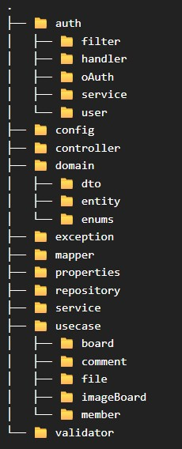

# BoardProject Kotlin version

<br/>
<br/>

## 프로젝트 개요

### 프로젝트 목적
- 언어 패러다임 전환: Java와 Kotlin의 문법적 차이를 넘어, Kotlin이 지향하는 함수형 프로그래밍과 불변성 관리 기법 학습
- 안정성 확보: Kotlin의 Null-Safety 메커니즘을 실제 비즈니스 로직에서 어느 수준까지 적용하고 제약할지에 대한 기준 수립
- 아키텍처 확장: Clean Architecture 적용을 통해 프레임워크와 비즈니스 로직의 결합도를 낮추는 설계 역량 강화

<br/>

### 프로젝트 요약
이 프로젝트는 소규모 커뮤니티 서비스를 직접 기획, 설계하여 새로운 기술 스택을 도입할 때 기준점으로 활용하는 테스트베드입니다.   

CRUD, 파일 시스템 관리, 계층형 쿼리 등 백엔드의 핵심 기능을 구현하며 각 환경의 특성을 분석하고 있습니다.   
현재는 React 기반의 공통 프론트엔드를 고정하고, 백엔드를 다양한 언어와 프레임워크로 재구현하며 아키텍처의 유연성을 검증하고 있습니다.


#### 프로젝트 버전
1. Spring MVC & JSP, Oracle (<a href="https://github.com/Youndae/BoardProject">Git Repo Link</a>)
   - 초기 설계 및 파일 관리 비즈니스 로직 확립한 최초 버전입니다.
   - 당시 가장 익숙했던 Spring MVC, JSP 환경을 사용하고 새롭게 Oracle을 사용해보며 MySQL과의 문법 및 동작 차이를 학습했습니다.
   - 설계 당시 주요 과제였던 효율적인 파일 관리 문제를 성공적으로 해결해 구현했습니다. 
2. Servlet & JSP, JDBCTemplate, MySQL (<a href="https://github.com/Youndae/BoardProject_servlet_jsp">Git Repo Link</a>)
   - 프레임워크의 추상화 계층을 제외한 Legacy 환경에서 요청 처리 흐름을 Low-level부터 파악했습니다.
   - JPA나 MyBatis 없이 JDBCTemplate을 직접 제어하며 영속성 계층의 동작 원리와 프레임워크가 제공하는 편의성의 실체를 체감했습니다.
3. REST API & React
   1. 공통 프론트엔드 (<a href="https://github.com/Youndae/boardProject_client_react">Git Repo Link</a>)
      - React(JSX)를 이용한 최초의 SPA 환경 구축 프로젝트입니다.
      - Axios 기반 통신 구조를 설계하고 컴포넌트 단위로 책임을 분리하여 유지보수성을 높였습니다.
      - 분리된 구조를 활용해 다양한 백엔드 스택의 REST API를 테스트하는 범용 프론트엔드로 활용중입니다.
   2. Spring Boot, JPA, MySQL 버전 (<a href="https://github.com/Youndae/rest-api-project">Git Repo Link</a>)
      - API 서버(board-rest)와 Client 서버(board-app)를 각각 독립적으로 구축했습니다.
      - board-rest(API Server)
        - 서비스의 핵심 비즈니스 로직 및 인증 / 인가를 전담하는 API 서버입니다.
        - JPA를 사용했으며, 데이터를 제공합니다.
      - board-app(View-Centric Server)
        - 자체 DB 없이 WebClient를 사용하여 board-rest와 통신하는 독립 실행 서버입니다.
        - 사용자로부터 받은 인증 정보와 요청을 API 서버로 전달하는 역할을 수행하며, Thymeleaf를 통해 사용자에게 view를 제공합니다.
        - 백엔드와 프론트엔드를 분리해 WebClient로 통신하는 환경 구축을 목적으로 설계하였으며, 서버간 통신 시 발생하는 데이터 직렬화 및 예외 처리 과정을 학습했습니다.
        - React 프론트엔드 구축 이후 리팩토링을 중단한 상태입니다.
   3. Kotlin, Spring Boot 버전
      - Java와 Kotlin의 차이점을 분석하고, data class를 활용한 불변 객체 통제 기법을 학습했습니다.
      - Clean Architecture를 적용하여 도메인 중심 설계를 지향하며, 엄격한 계층 분리가 가져오는 생산성 저하와 같은 실질적인 단점을 분석하고 해결책을 고민했습니다.
   4. Express 버전 - <a href="https://github.com/Youndae/boardproject_ex">Git Repo Link</a>
      - Spring 환경을 벗어나 Middleware 기반 아키텍처의 빠른 응답 처리와 서비스 레이어의 부담 완화 라는 장점을 확인했습니다.
      - 프레임워크 차원의 트랜잭션 관리 부재로 인해 통합 테스트 시 발생하는 데이터 정합성 관리의 복잡성을 체감했으며, 이를 보완하기 위한 테스트 환경 설계 역량을 키웠습니다.
   5. Nest 버전 - <a href="https://github.com/Youndae/boardproject_nest">Git Repo Link</a>
      - Module 구조를 통한 체계적인 의존성 관리 방식을 학습했습니다.
      - 의존성 증가에 따라 모듈이 무거워질 수 있다는 단점을 파악하고, 효율적인 모듈 바운더리 설정이 NestJS 설계의 핵심임을 이해했습니다.
      - TypeScript의 엄격한 타입을 통해 Runtime 이전 단계에서의 안정성 확보를 경험했습니다.

## 목차
<strong>1. [개발 환경](#개발-환경)</strong>
<strong>2. [프로젝트 구조 및 설계 원칙](#프로젝트-구조-및-설계-원칙)</strong>
<strong>3. [ERD](#ERD)</strong>
<strong>4. [기능 목록](#기능-목록)</strong>
<string>5. [핵심 기능 및 문제 해결](#핵심-기능-및-문제-해결)</strong>

<br/>
<br/>

## 개발 환경
|category| Tech Stack|
|---|---|
|Backend| - Kotlin 1.9.21 <br/> - Spring Boot 3.2.1 <br/> - Spring Data JPA <br/> - QueryDSL <br/> - mapstruct |
|Security| - SpringSecurity <br/> - OAuth2 <br/> - JWT                                                          
|Frontend| - React(CRA) <br/> - Redux Toolkit <br/> - Styled Components <br/> - Axios <br/> - React Cookie      |
|Database| - MySQL <br/> - Redis                                                                                |
|Libraries| - kap <br/> - Kotlin Logging <br/> - Spring Validation <br/> - Thumbnailator|

<br/>
<br/>

## 프로젝트 구조 및 설계 원칙

### 패키지 및 레이어 분리

프로젝트 구조는 명확하게 분리하는것을 규칙으로 삼고 설계했습니다.
- UseCase 분리
  - 도메인별 패키지 하위로 비즈니스 로직의 의도를 명확히 하기 위해 Read와 Write UseCase로 분리했습니다.
- Service 분리
  - Domain과 Data Service로 역할을 세분화하여 설계했습니다.
  - 현재 규모에서는 Data Service만 사용되고 있으나, 복잡도 증가 시 유연하게 확장 가능한 구조를 유지하고 있습니다.



<br/>

### API 응답 표준화

개선을 통해 응답 데이터만 보내는 구조에서 일관성 있는 구조의 응답으로 표준화를 수행했습니다.   
content의 경우 필요하지 않은 응답도 있는것을 고려해 null을 허용했습니다.   
표준화를 통해 클라이언트에서 항상 같은 구조의 응답을 받고 접근이 용이하도록 개선했습니다.

<details>
    <summary><strong>✔️ 표준 응답 객체 코드</strong></summary>

```kotlin
data class ApiResponse<T>(
    val code: Int,
    val message: String,
    val content: T? = null,
    val timestamp: OffsetDateTime = OffsetDateTime.now()
) {
    companion object {
        fun <T> success(
            content: T,
            message: String = ResponseStatus.SUCCESS.message
        ): ApiResponse<T> = ApiResponse(
            code = HttpStatus.OK.value(),
            message = message,
            content = content
        )
        
        fun <T> success(
            message: String
        ): ApiResponse<T> = ApiResponse(
            code = HttpStatus.OK.value(),
            message = message
        )
        
        fun <T> created(
            content: T,
            message: String = ResponseStatus.SUCCESS.message
        ): ApiResponse<T> = ApiResponse(
            code = HttpStatus.CREATED.value(),
            message = message,
            content = content
        )
    }
}
```

</details>

### 예외 핸들링

GlobalExceptionHandler를 통해 예외 처리를 관리합니다.   
CustomException을 Exception.kt 파일에서 공통 관리하며, ErrorCode Enum을 통해 HTTP 상태 코드와 메시지를 중앙 관리하여 매직 넘버 사용을 지양하고 가독성을 높였습니다.   

예외 응답 역시 표준화를 위해 ExceptionResponse 객체를 통해 응답하게 되며,   
Spring Validation 과정에서 발생하는 예외 메시지를 위해 errors 필드가 존재합니다.   
하지만, 다른 예외처리에서는 불필요한 필드이기 때문에 JsonInclude를 통해 비어있는 경우 응답에 포함되지 않도록 처리했습니다.
<details>
    <summary><strong>✔️ 표준 예외 응답 객체 코드</strong></summary>

```kotlin
data class ExceptionResponse<T> (
    val code: Int,
    val message: String,

    @JsonInclude(JsonInclude.Include.NON_EMPTY)
    val errors: List<T>? = null,

    val timestamp: OffsetDateTime = OffsetDateTime.now()
) {
    companion object {
        fun <T> exception(
            errorCode: ErrorCode,
            message: String = ResponseStatus.FAIL.message
        ): ExceptionResponse<T> = ExceptionResponse(
            code = errorCode.httpStatus.value(),
            message = message
        )

        fun <T> validationException(
            errorCode: ErrorCode,
            errors: List<T>,
            message: String = ResponseStatus.FAIL.message
        ) : ExceptionResponse<T> = ExceptionResponse(
            code = errorCode.httpStatus.value(),
            errors = errors,
            message = message
        )
    }
}
```

</details>

Validation 메시지는 재가공해 클라이언트가 즉시 렌더링에 사용할 수 있도록 Mapping 하여 반환합니다.

<details>
    <summary><strong>✔️ GlobalExceptionHandler 코드</strong></summary>

```kotlin
@RestControllerAdvice
class GlobalExceptionHandler : ResponseEntityExceptionHander() {
    // CustomException 공통 처리
    @ExceptionHandler(BusinessException::class)
    fun handleBusinessException(e: BusinessException): ResponseEntity<ExceptionResponse<Unit>> {
        log.warn { "Business Error: ${e.message}" }

        return ResponseEntity.status(e.errorCode.httpStatus.value())
            .body(
                ExceptionResponse.exception(
                    errorCode = e.errorCode,
                    message = e.message
                )
            );
    }
    
    // Spring Validation 예외처리
    override fun handleMethodArgumentNotValid(
        ex: MethodArgumentNotValidException,
        headers: HttpHeaders,
        status: HttpStatusCode,
        request: WebRequest
    ): ResponseEntity<in Any>? {
        log.warn { "HandleMethodArgumentNotValidExceptionHandler::message : ${ex.message}" }
        log.warn { "HandleMethodArgumentNotValidExceptionHandler::AllErrors : ${ex.allErrors}" }

        val errors: List<ValidationError> = ex.fieldErrors
            .map { err -> ValidationError(
                field = err.field,
                constraint = err.code,
                validationMessage = err.defaultMessage
            ) }


        return ResponseEntity.badRequest()
            .body(
                ExceptionResponse.validationException(
                    errorCode = ErrorCode.BAD_REQUEST,
                    errors = errors,
                    message = ErrorCode.BAD_REQUEST.message
                )
            )
    }
}
```

</details>

<br/>
<br/>

## ERD


<br/>
<br/>

## 기능 목록

<details>
    <summary><strong>계층형 게시판</strong></summary>

* 게시글 목록
    * 게시글 검색( 제목, 작성자, 제목 + 내용 )
    * 페이지네이션
    * 계층형 구조
* 게시글 상세
    * 작성자의 게시글 수정, 삭제, 답글 작성
    * 로그인한 사용자의 답글 작성, 댓글 작성
    * 로그인한 사용자의 대댓글 작성
    * 댓글 작성자의 댓글 삭제
    * 댓글 페이지네이션
* 게시글 작성
* 게시글 수정
* 답글 작성
</details>

<br/>

<details>
    <summary><strong>이미지 게시판</strong></summary>

* 게시글 목록   
    * 게시글 검색 ( 제목, 작성자, 제목 + 내용 )   
    * 페이지네이션   
* 게시글 상세
    * 작성자의 게시글 수정, 삭제, 답글 작성
    * 로그인한 사용자의 답글 작성, 댓글 작성
    * 로그인한 사용자의 대댓글 작성
    * 댓글 작성자의 댓글 삭제
    * 댓글 페이지네이션
* 게시글 작성
    * 이미지 파일 업로드(최소 1장 필수. 최대 5장)
    * 텍스트 내용 작성
* 게시글 수정
    * 기존 이미지 파일 삭제
    * 추가 이미지 업로드(기존 파일 포함 최대 5장)
</details>

<br/>
<br/>

## 핵심 기능 및 문제 해결

<br/>

### 목차
1. **[로그인](#로그인)**
2. **[ConfigurationProperties 문제 해결](#ConfigurationProperties-문제-해결)**

<br/>
<br/>

### 로그인

로그인은 아이디와 비밀번호를 직접 입력하는 로컬 로그인과 Google, Kakao, Naver를 통한 OAuth 로그인이 있습니다.   
모든 인증 성공 시 JWT를 발급합니다.   

1. 토큰 관리 방식
- 토큰 종류
  - JWT는 AccessToken과 RefreshToken로 설계했으며 RTR 방식을 채택했습니다
  - 추가로 ino라는 UUID기반 난수값을 발급하며, 이는 디바이스별 다중 로그인을 허용하기 위한 식별자 역할을 수행합니다.
- 토큰 관리
  - 클라이언트에서 모든 토큰, ino는 쿠키로 관리합니다.
  - 백엔드에서는 RDB가 아닌 Redis에서 토큰을 관리하며 AccessToken, RefreshToken만 저장해 관리합니다.
  - Redis Key 구조는 token별 prefix + ino + userId 구조로 설계했습니다.
  - 재발급은 401 TOKEN_EXPIRE를 반환하는것이 아닌 바로 RefreshToken을 검증하고 정상적이라면 즉시 재발급을 수행, 사용자의 요청까지 모두 처리한 뒤 응답 쿠키로 같이 전달하는 방식을 채택했습니다.

2. 로컬 로그인 처리
- Spring Security의 기본 로그인이나 별도의 EndPoint를 Controller에 직접 작성해 처리하는 방식 대신 LoginFilter를 작성해 해당 필터에서 처리합니다.

3. OAuth2 로그인
- 응답 추상화
  - 각 Provider 마다 다른 사용자 정보 규격을 OAuth2Response 인터페이스로 추상화하여 확장성을 확보했습니다.
- Redirect 흐름 개선
  - 기존 프론트엔드에서 화면이 비어있는 컴포넌트인 OAuth.jsx와 SessionStorage를 사용하여 이전 경로로 연결될 수 있도록 처리했습니다. 하지만 이 방식은 인증 완료 후 불필요한 라우팅이 한번 더 발생하는 구조였습니다.
  - 문제 해결을 위해 로그인 요청 시점에 이전 경로를 redirect_to 쿠키에 저장하고 백엔드는 SuccessHandler에서 이를 읽어 Redirect 할 수 있도록 개선했습니다. 이를 통해 프론트엔드에서 불필요한 로직과 라우팅을 제거하고 흐름을 단순화 할 수 있었습니다.

<details>
    <summary><strong>✔️ OAuthResponse 코드</strong></summary>

```kotlin
interface OAuth2Response {
    val provider: String
    val providerId: String
    val email: String
    val name: String
}


class GoogleResponse(
    private val attributes: Map<String, Any>
) : OAuth2Response {
    override val provider: String = OAuthProvider.GOOGLE.key
    
    override val providerId: String
        get() = attributes["sub"].toString()

    override val email: String
        get() = attributes["email"].toString()

    override val name: String
        get() = attributes["name"].toString()
}
```

</details>

<details>
    <summary><strong>✔️ OAuthSuccessHandler 코드</strong></summary>

```kotlin
@Component
class CustomOAuthSuccessHandler(
    private val tokenProvider: TokenProvider,
    private val cookieProperties: CookieProperties
) : SimpleUrlAuthenticationSuccessHandler() {
    override fun onAuthenticationSuccess(
        request: HttpServletRequest,
        response: HttpServletResponse,
        authentication: Authentication
    ) {
        val customOAuth2User: CustomOAuth2User = authentication.principal as CustomOAuth2User
        val userId = customOAuth2User.userId
        val redirectCookie = WebUtils.getCookie(request, "redirect_to")
        val redirectUrl = redirectCookie?.value ?: "/"
        val inoCookie = WebUtils.getCookie(request, cookieProperties.ino.header)

        redirectCookie?.apply {
            path = "/"
            maxAge = 0
            response.addCookie(this)
        }
        
        if(inoCookie == null)
            tokenProvider.issuedAllToken(userId, response)
        else
            tokenProvider.issuedToken(userId, inoCookie.value, response)

        val targetUrl = if(customOAuth2User.getNickname() == null)
                            "/join/profile?redirect=${URLEncoder.encode(redirectUrl, "UTF-8")}"
                        else
                            URLDecoder.decode(redirectUrl, StandardCharsets.UTF_8.toString())

        redirectStrategy.sendRedirect(request, response, "http://localhost:3000${targetUrl}")
    }
}
```

</details>

<br/>
<br/>

## ConfigurationProperties 문제 해결

1. 문제 상황
   - 불변성 보장을 위해 @ConfigurationProperties 객체를 data class로 정의했습니다.
   - 서버 실행시 Cloud not generate CGLIB subclass ... 로그와 함께 애플리케이션이 실행되지 않는 현상이 발생했습니다.

2. 원인 분석
   - 로그 분석을 먼저 해본 결과 @ConfigurationProperties가 포함된 클래스는 스프링 컨테이너에 의해 Bean으로 등록될 때, CGLIB를 통해 해당 클래스를 상속 받는 프록시 객체 생성 시도가 실패했다는 점을 알게 되었습니다.
   - CGLIB는 대상 클래스를 상속받아 프록시를 만들게 되는데 data class는 final 이므로, final 클래스의 상속 불가로 인해 발생한 문제라는 것을 알 수 있었습니다.
   
3. 해결 방안
   - data class 대신 class로 정의하고 생성자 파라미터에 val을 선언하여 불변성을 유지했습니다.
   - val 로 정의하는 것으로 가장 중요했던 불변성이라는 목적을 달성할 수 있었습니다.

4. 회고
   - Kotlin의 data class의 불변성만을 생각한 설계가 아닌, 프레임워크의 동작하는 방식과 같이 생각해서 설계해야 한다는 점을 학습할 수 있었습니다.

<br/>
<br/>

## 프로젝트 회고

Java 기반의 Spring Boot 환경에서 Kotlin으로 전환하며 단순한 문법 변환 이상의 설계적 패러다임 변화와 Java에서는 미처 깨닫지 못했던 동작 구조를 알 수 있었습니다.

1. Null에 대한 관점 변화

Java 환경에서는 Null-Safety라는 개념이 없이 의도적으로 체크, 혹은 Optional을 사용해왔습니다.   
하지만 Kotlin에서는 강력한 Null-safety로 인해 Java에서는 미처 생각하지 못했거나, 익숙해서 생각없이 넘어갔던 문제점이 많았습니다.   
흔히 Kotlin의 Null-Safety에 대한 장점으로 null 체크를 하지 않아도 되므로 코드가 단순해지고 NullPointerException을 방어할 수 있다고 하지만,   
저에게 이번 Kotlin으로의 전환은 코드가 줄어들고 로직에만 집중한다는 장점보다 Java 환경에서 얼마나 null을 무심하게 바라봤는지에 대해 반성하는 계기가 되었습니다.

2. 프레임워크와의 마찰

이번 @ConfigurationProperties 이슈를 경험하며 Proxy 기반의 스프링 메커니즘과 Kotlin의 final 특성이 충돌하는 것을 경험했습니다.   
이를 해결하는 과정에서 스프링의 내부 동작 원리를 다시금 들여다보는 기회가 되었습니다.   

3. 마치며

이번 프로젝트에서는 단순히 Kotlin으로의 전환과 적응, 경험을 쌓는 과정을 넘어 더 안정적이고 유연한 아키텍처를 위해 고려해야 할 것들에 대해 많은 생각을 하게 되었던 과정이었습니다.   
어느 언어, 기술을 사용하더라도 기본이 되는 설계 원칙과 고려사항, 문제 해결에 대한 분석과 과정은 변하지 않는다는 것을 다시 한번 느낄 수 있었습니다.