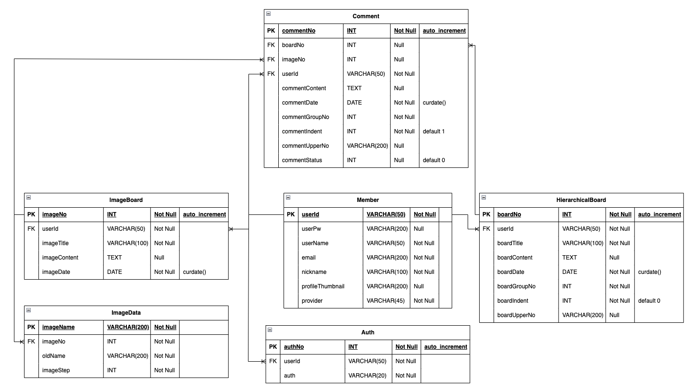
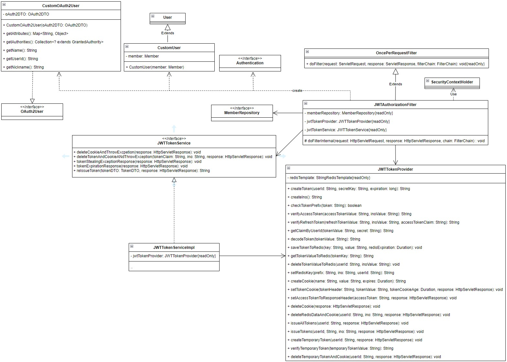
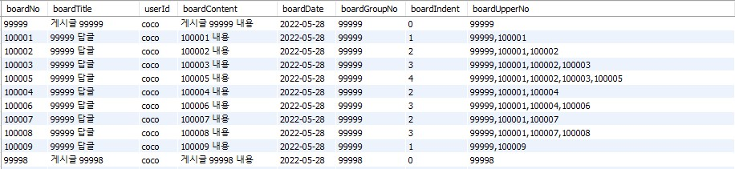

# BoardProject Kotlin

## 프로젝트 환경

---

* Spring Boot 3.2.1
* kapt 1.9.21
* Spring-Data-JPA
* Hibernate
* QueryDSL
* OAuth2
* Slf4j
* MySQL
* Redis
* JWT
* Spring Security
* Gradle

## 목표

---

Clean Architecture 구조로 구현   
기존 BoardProject_REST를 Kotlin으로 구현   
Kotlin class, Data Class 등 객체 생성 및 처리 적응   
Java와의 차이점 확인   


## 프로젝트 설명

---

2개의 게시판으로 이루어진 커뮤니티 페이지로 텍스트 기반, 이미지 업로드가 가능한 게시판으로 구성.   
단순하지만 기본적인 CRUD가 포함된 프로젝트로 새로 학습한 내용 혹은 기술을 적용해보고 테스트하는데 활용.   

### BoardProject 버전
1. Spring, JSP, Oracle, MyBatis 환경
   - https://github.com/Youndae/BoardProject
2. Servlet & JSP, JDBCTemplate, MySQL 환경
   - https://github.com/Youndae/BOardProject_servlet_jsp
3. SpringBoot, Spring Data JPA, QueryDSL, MySQL 환경 REST-API
   - https://github.com/Youndae/rest-api-project
4. SpringBoot, Kotlin, Spring Data JPA, QueryDSL, MySQL 환경
   - 현재 Repository

초기 JSP 버전과 Servlet & JSP 버전은 완전히 동일한 기능을 갖고 있으며 각 버전에 따라 인증 / 인가 차이 및 환경에 따른 처리과정 차이만 발생.   
REST-API 버전과 Kotlin 버전의 경우 oAuth2가 추가되어 있으며, 인증 / 인가 역시 JWT와 Spring Security로 처리.   
REST-API와 Kotlin은 동일한 Front-end를 공유하며 현재는 1, 2번 환경은 더이상 개선하지 않고 3, 4번 버전 위주로 개선.


## 프로젝트 기능

---

### 이미지 게시판 & 계층형 게시판

- 페이징
- 검색
- 게시글 등록(이미지 포함 혹은 텍스트 기반)
- 작성자의 게시글 수정, 삭제
- 댓글 작성 및 삭제(계층형)

### 사용자

- 로그인
    - local
    - oAuth2 (Google, Kakao, Naver)
- 로그아웃
- 정보수정

## ERD

---



## 구조

---

### Front-end

React 기반의 기존 프로젝트 Front-end
- https://github.com/Youndae/boardProject_client_react

### Back-end
- Clean Architecture 구조로 controller -> UseCase -> Service -> Repository 구조.
  - Clean Architecture 방식 선정 이유
    - 항상 Layered Architecture 방식으로만 프로젝트를 개선하고 개발해왔는데 새롭게 Clean Architecture에 대해 알게 되었고 Service Layer를 Application Layer와 Business Logic Layer로 나누게 되면서 각 계층에서의 책임을 분배하면 더 유연성 있는 코드를 작성할 수 있을 것이라고 생각했습니다.   
      실제로 Service 클래스에서는 각 기능을 세분화해 비즈니스 로직을 수행하도록 책임 분배가 이루어졌고 그 서비스 메소드들을 UseCase에서 호출하는 방법을 통해 로직을 캡슐화하고 관리할 수 있게 되었습니다.   
      또한, 서비스에서 서비스를 호출하는 의존성 문제가 발생할 여지가 있는 케이스에 대한 대응도 가능합니다. 다른 서비스의 기능이 필요한 경우 UseCase에서 호출하고 응답을 받도록 처리하고 해당 응답을 통해 또 다른 서비스 메소드를 호출하는 것으로 서비스 간의 의존성 문제도 개선할 수 있다는 장점이 있습니다.
- Service의 경우 1 : 1 매핑이기 때문에 Interface를 사용하지 않고 Class로 직접 접근하는 방식으로 구현.   
- 클래스 직접 접근 방식 선정 이유
  - BoardProject의 경우 Interface와 구현체의 1 : 1 매핑이 이루어지기 때문에 '중간에 Interface가 존재해야 할 이유가 없지 않나' 라는 생각에 해당 구조에 대해 알아봤더니, 꼭 인터페이스가 존재해야 할 필요는 없다는 것을 알게 되었습니다.   
    인터페이스가 중간에 위치하면서 얻는 이점으로는 유연성을 확보해 추가적인 구현체 생성을 해야 하는 경우 호출하는 레이어에서 큰 수정없이 사용이 가능하다는 점이 이점이지만, 1 : 1 매핑의 경우 필요 이상으로 복잡한 설계가 되기 때문에 사용하지 않는 경우가 있다는 것을 알 수 있었습니다.   
    또한, 간결함과 생산성을 강조하는 Kotlin이 등장했고, 인터페이스를 생성하지 않아도 클래스에서 확장 함수 및 고차함수, 람다식을 사용하는 등 클래스와 인터페이스의 차이가 좁혀지게 되면서 더욱 그 의견에 힘이 실렸다고 알 수 있었습니다.   
    BoardProject의 경우 매우 작은 프로젝트이며 1 : 1 매핑으로 기능이 동작하고 추후 인터페이스가 필요하더라도 수정 과정에서 문제가 될 부분이 적다고 생각했기 때문에 인터페이스를 사용하지 않고 클래스에 직접 접근하는 방식을 선택했습니다.   
  - 클래스 직접 접근 방식을 선택하게 되면서 얻은 이점으로는 서비스 메소드의 책임 분리가 수월해졌고, 분리된 메소드 중 다른 기능에서 필요한 메소드인 경우 인터페이스에 추가적인 작성과 구현 처리를 할 필요없이 바로 사용이 가능해 간결해진다는 점이 있었습니다.   
    인터페이스를 통하지 않고 클래스에 직접 접근하게 되면서 클래스 내부의 접근 제어자 선언에 대한 고민 비중이 좀 더 증가할 수 있겠으나 인터페이스를 통한 환경에서도 접근 제어자는 외부 접근을 허용할 것인지 항상 고려해야 했기 때문에 큰 문제가 되지 않는다고 생각했습니다.   
    


## 기능 상세

---

### 목차

- 로그인
- 인증 / 인가(JWT 설계와 관리)
- 인증 / 인가(인증 Filter 및 토큰 검증 및 권한 관리)
- 응답 데이터 Factory
- 계층형 구조 처리
- 문제 해결 (Kotlin의 @Value Annotation)

<br />

### 로그인

---

사용자 로그인 기능은 직접 회원가입을 한 뒤 로그인하는 local 로그인과 google, kakao, naver를 통한 oAuth2 로그인이 있습니다.   
oAuth2를 사용하며 로그인 처리 외에는 사용자 정보를 받아오는 별도의 기능이 없기 때문에 각 Authorization Server에서 제공하는 기본제공 데이터만 받도록 처리하고, 토큰 역시 따로 관리하지 않았습니다.   

로그인에 대한 처리는 Spring Security를 통해 처리하고 있으며, local 로그인은 Spring Security의 기본 로그인 경로를 사용하지 않고 Controller로 접근한 뒤 직접 처리하는 방법으로 구현했습니다.
oAuth2 로그인은 Client에서 하이퍼링크를 통해 로그인 요청을 보내게 되고 Back-end에서 Spring Security를 통해 처리하게 됩니다.   
oAuth2 처리에 필요한 설정 값은 application-oauth.yml에 따로 분리해서 관리하도록 하고 Spring Security를 통해 EndPoint와 SuccessHandler를 처리했습니다.   
이 처리 과정 중 필요한 각 Authorization Server의 Response를 받을 클래스와 converter, 요청을 처리할 OAuth2UserService, SuccessHandler, OAuth2User를 직접 생성하고 custom해 관리합니다.   
각 클래스들은 아래 링크에서 확인하실 수 있습니다.   
https://github.com/Youndae/boardProject_kt/tree/master/src/main/kotlin/com/example/boardproject_kt_ver_default/auth/oAuth

Authorization Server에서 요청에 대한 응답의 경우 각 서버마다 차이가 발생하는 경우가 있었기 때문에 GoogleResponse 와 같이 각 서버명 + Response 명으로 클래스를 관리하며 OAuth2Response라는 인터페이스를 구현하도록 해 필요한 데이터를 공통적으로 담을 수 있도록 했습니다.

```kotlin
//OAuth2Response Interface
interface OAuth2Response {
    val provider: String
    val providerId: String
    val email: String
    val name: String
}

//GoogleResponse class
class GoogleResponse(
    private val attributes: Map<String, Any>
): OAuth2Response {
    override val provider: String = OAuth2Provider.GOOGLE.key
    
    override val providerId: String
        get() = attributes["sub"].toString()
    
    override val email: String
        get() = attributes["email"].toString()
    
    override val name: String
        get() = attributes["name"].toString()
}
```

요청에 대한 응답이 성공적으로 반환된다면 DefaultOAuth2UserService를 상속받는 CustomOAuth2UserService로 접근하게 되고 사용자 데이터 처리 후 CustomOAuth2User를 반환하게 됩니다.   
이후 모든 처리가 완료된다면 CustomOAuth2SuccessHandler에 접근해 토큰을 생성합니다.   
최초 로그인한 사용자의 경우 닉네임 데이터가 없기 때문에 설정 페이지로 redirect하도록 하고, 기존 사용자의 경우 /member/oAuth 경로로 redirect하도록 했습니다.
```kotlin
@Component
class CustomOAuth2SuccessHandler(
    private val tokenProvider: JwtTokenProvider,
    private val cookieProperties: CookieProperties
): SimpleUrlAuthenticationSuccessHandler() {
    
    override fun onAuthenticationSuccess(
        request: HttpServletRequest,
        response: HttpServletResponse,
        authentication: Authentication
    ) {
        val customOAuth2User: CustomOAuth2User = authentication.principal as CustomOAuth2User
        val userId = customOAuth2User.userId
        
        val redirectCookie = WebUtils.getCookie(request, "redirect_to")
        val redirectUrl = redirectCookie?.value ?: "/"
        val inoCookie = WebUtils.getCookie(request, cookieProperties.ino.header)
        
        redirectCookie?.apply {
            path = "/"
            maxAge = 0
            response.addCookie(this)
        }
        
        if(inoCookie == null)
            tokenProvider.issuedAllToken(userId, response)
        else
            tokenProvider.issuedToken(userId, inoCookie.value, response)
        
        val targetUrl = if(customOAuth2User.getNickname() == null)
                            "/join/profile?redirect=${URLEncoder.encode(redirectUrl, "UTF-8")}"
                        else
                            URLDecoder.decode(redirectUrl, StandardCharsets.UTF_8.toString())
        
        redirectStrategy.sendRedirect(request, response, "http://localhost3000${targetUrl}")
    }
}
```

기존 사용자의 경우 /member/oAuth 경로로 redirect하는 이유는 이전 페이지 정보를 처리하기 위함입니다.   
oAuth2 요청을 하이퍼링크로 처리하다보니 서버에서 referer로 접근하는 것이 불가능합니다.   
그래서 client에서는 oAuth2 요청이 발생하는 경우 이전 페이지의 주소를 sessionStorage에 저장한 뒤 요청을 보내도록 하고, 이후 /member/oAuth 경로로 컴포넌트에 접근한다면 useEffect를 통해 sessionStorage에 저장해두었던 이전 페이지 값을 가져와 다시 페이지 전환을 하도록 했습니다.   
이 문제의 다른 해결 방법으로 history.go()를 사용하는 방법을 제시하는 것도 많이 봤지만, history.go()의 경우 페이지 이동이아닌 뒤로가기 버튼을 눌렀을때와 같은 효과를 보이기 때문에 해결 방안이 아니라고 생각했습니다.   

<br/>

### 인증 / 인가(JWT 설계와 관리)

---

인증 / 인가는 JWT와 Spring Security를 통해 처리합니다.   
클라이언트로 전달되는 토큰은 총 3가지로 설계했습니다.   
JWT에 속하는 AccessToken, RefreshToken이 존재하며 다중 로그인을 허용하기 위한 식별자 개념의 ino라는 토큰을 하나 더 만들었습니다.   
AccessToken과 RefreshToken은 JWT 라이브러리를 통해 생성하고 검증, 관리하게 되며 ino는 난수값으로 생성합니다.   

클라이언트에서 토큰 관리는 모두 Cookie에서 관리하도록 처리했습니다.   
JWT를 처음 학습하고 토큰 관리에 대해 알아보며 LocalStorage와 Cookie에 대한 의견이 분분하다는 것을 알 수 있었습니다.   
각 저장위치에 대해서는 장단점이 존재하지만 Man's Shop에서는 LocalStorage에 AccessToken을 저장하고 BoardProject에서는 Cookie에 저장하는 방법으로 두 방법 모두 수행했습니다.   

토큰 재발급 방식에 대해서는 RefreshToken Rotation 방식으로 AccessToken 만료 시 두 토큰을 모두 재발급하도록 설계했습니다.   
만료 기간으로는 AccessToken은 1시간, RefreshToken은 2주를 갖습니다.   

여기서 쿠키 만료시간은 모두 30일의 기간을 갖도록 하고 ino는 9999의 만료기간을 설정했습니다.   
토큰 만료기간보다 더 긴 쿠키 만료기간을 설계했는데 그 이유로는 토큰 탈취에 대응하기 위함이었습니다.   
만약 모든 토큰이 탈취된 경우 RefreshToken과 AccessToken이 모두 갱신되어 토큰이 만료된건지 탈취된 것인지 알기 어렵다는 단점이 있었습니다.   
단일 로그인 허용이라면 토큰 저장 시 아이디와 매핑되어 있기 때문에 괜찮지만 다중 로그인을 허용하다보니 아이디만으로 매핑할 수 없었기에 ino와 아이디가 같이 매핑됩니다.   

토큰을 Redis에 저장하고 관리하게 되는데 Redis 데이터의 키값으로는 각 토큰의 약어로 at 혹은 rt로 시작하며 ino값 + 사용자 아이디 구조로 설계했습니다.   
이렇게 설계하게 되면서 다중 로그인에 대해 토큰을 관리할 수 있게 되었고 토큰이 재발급되더라도 ino는 재발급되지 않기 때문에 동일한 ino를 갖는 키의 값이 전달된 토큰과 다르다면 탈취로 판단할 수 있다는 이점이 있었습니다.   

이 설계에 대해서는 고민이 많았습니다. ino가 9999의 기간을 갖는만큼 AccessToken과 RefreshToken의 Cookie 값도 토큰과 동일한 만료시간을 가져도 괜찮지 않을까 라는 생각도 했었지만, 아직 명확하게 답을 찾지 못해 개선하지 못한 상황입니다.   
보통 토큰 인증 방식을 사용하는 경우 AccessToken만 요청시에 받고 재발급시에는 RefreshToken만 받아 검증하는 방식이 사용되는 것으로 알고 있는데 탈취에 대한 명확한 해답을 아직 찾지 못해 JWT 보안에 대한 추가 학습 이후 개선을 계획하고 있습니다.

<br/>

### 인증 / 인가(인증 Filter 및 토큰 검증 및 권한 관리)

---



Spring Security 설정파일에서의 설정으로 인해 모든 요청은 JWTAuthorizationFilter를 거치게 됩니다.   
Filter에서 토큰 검증과 인증 객체를 생성하는 과정을 처리하게 되고, 토큰이 전달되지 않은 요청에 대해서는 인증, 인가 과정을 거치지 않고 처리를 넘기게 됩니다.   

BoardProject에서는 클라이언트 요청 시 토큰 재발급 시점을 확인하고 필요하다면 재발급을 처리하여 요청에 대한 응답과 같이 토큰을 전달하도록 설계했습니다.   
JWT를 학습하면서 기본적으로 제시되는 예시는 클라이언트에서 요청 후 만료 시 재발급 요청을 다시 보내고 이후 사용자 요청을 재전달하는 방식으로 3번의 요청이 발생하게 됩니다.   
BoardProject에서는 이 3번의 과정을 1번의 요청으로 모두 해결할 수 있는 방법으로 처리해보고자 했고, Filter에서 토큰 검증 이후 재발급이 필요하다면 바로 재발급을 처리할 수 있도록 설계했습니다.   
모든 토큰은 Cookie로 저장되면 되기 때문에 ResponseCookie로 쿠키를 생성하고 담아두었다가 클라이언트 요청을 모두 처리한 뒤 응답값과 함께 클라이언트로 전달됩니다.   
이때, 재발급되는 토큰은 AccessToken과 RefreshToken만 재발급 되며 Cookie 보안으로는 secure, httpOnly, sameSite를 Strict로 설정해 생성합니다.   
이 설정들로 인해 클라이언트에서는 쿠키를 조작할 수 없도록 했기 때문에 모두 서버에서 Cookie를 조작할 수 있도록 했습니다.

Filter에 접근하게 되면 가장 먼저 Cookie를 통해 토큰이 정상적으로 전달되었는지 확인합니다.   
모두 존재하지 않거나 ino만 존재하는 경우 비로그인 상태로 간주하고 토큰을 검증하지 않고 처리를 마무리하게 되며, AccessToken, RefreshToken 중 하나만 존재한다면 탈취로 판단하고 모든 토큰을 제거 후 탈취 응답을 반환해 사용자가 재로그인할 수 있도록 처리합니다.   
Redis 데이터와 일치하지 않는 경우에도 탈취로 판단하고 처리하며 정상적인 검증 과정을 거치게 된다면 이후 SecurityContextHolder에 인증객체를 담아 Spring Security를 통한 권한 관리를 할 수 있도록 처리한 뒤 Filter 처리를 마무리하도록 설계했습니다.   

이 과정에서 문제가 되었던 부분은 토큰 탈취시 응답에 대한 처리였습니다.   
Filter 내부에서 발생한 오류는 @RestControllerAdvice를 통한 전역관리 핸들러에서 처리되지 않기 때문에 Filter 내부에서 직접 처리해야 했습니다.   
이 문제를 해결하기 위한 방법으로 Filter 내부에 예외처리 메소드를 생성하고 HttpServletResponse에 예외에 대한 응답을 설정한 뒤 return 을 통해 바로 응답하도록 처리했습니다.


### 응답 데이터 Factory

---

프로젝트를 진행하며 공통적으로 처리해야 하는 부분들이 발생했습니다.
String, Long 타입의 응답과 Pagination 관련, 상세 페이지 관련된 응답이었습니다.   
응답하는 부분에 있어서는 UseCase에서 반환받은 값을 그대로 ResponseEntity에 담아 응답하는 것도 괜찮았지만 좀 더 개선된 방법을 사용해보고자 Factory 클래스를 만들어 처리해봤습니다.   

```kotlin
@Component
class ResponseFactory(
    private val principalService: PrincipalReadService
) {
    fun createStringResponse(result: String): ResponseEntity<String> = ResponseEntity.status(HttpStatus.OK).body(result)
    
    fun createLongResponse(result: Long): ResponseEntity<Long> = ResponseEntity.status(HttpStatus.OK).body(result)
    
    fun <T> createPaginationList(
        result: Page<T>,
        principal: Principal?
    ): ResponseEntity<ResponsePageableListDTO<T>> {
        val nickname = principalService.getNicknameToPrincipal(principal)
        
        return ResponseEntity.status(HttpStatus.OK)
                .body(ResponsePageableListDTO(result, nickname))
    }
    
    fun <T> createDetailResponse(
        result: T,
        principal: Principal?
    ): ResponseEntity<ResponseDetailDTO<T>> {
        val nickname = principalService.getNicknameToPrincipal(principal)
        
        return ResponseEntity.status(HttpStatus.OK)
                .body(ResponseDetailDTO(result, nickname))
    }
}
```

Pagination과 상세 페이지에 대해서는 이미지 게시판, 텍스트 게시판으로 나눠지기 때문에 제네릭을 사용해 처리하도록 하고 댓글 또는 게시글 수정, 삭제 권한 여부를 위해 Principal 객체를 통한 사용자 닉네임을 같이 담아 반환하도록 설계했습니다.   
이렇게 처리하게 되면서 응답 객체 틀을 정형화할 수 있게 되었고 중복되는 코드를 줄이는 결과를 볼 수 있었습니다.   
 
<br/>

### 계층형 구조 처리

---

계층형 구조 처리는 데이터베이스 테이블 설계에서 처리했습니다.   



테이블에서 GroupNo, Indent, UpperNo 컬럼을 갖고 있으며, GroupNo는 최상위 계층의 글 번호를 갖게 됩니다.   
indent는 계층을 의미하며 0부터 시작하도록 처리했고, UpperNo를 최상위 계층부터 자신까지 모든 경로륻 담도록 처리했습니다.   
이 방법을 통해 GroupNo로 정렬한 뒤 UpperNo로 재정렬 하면 계층형을 간단하게 처리할 수 있습니다.   

이전에는 UpperNo에 한 계층 위의 글번호를 갖도록 처리했었는데 그렇게 처리하는 경우 계층형 구조를 만들기 위해 재귀쿼리 또는 procedure를 사용하는 등 쿼리가 복잡해지게 되는 문제가 있었습니다.   
재귀 쿼리 결과를 확인했을 때 현재 구조와 동일한 구조로 처리되는 것을 확인할 수 있었고 거기서 힌트를 얻어 UpperNo의 구조를 현재와 같이 처리하는 방법을 통해 간결하게 처리할 수 있었습니다.   

이 방법의 문제는 UpperNo가 1 정규형을 위배와 무결성 위배에 대한 문제점 발생 여지가 있다는 점입니다.   
무결성의 경우 하위 계층이 존재하는 게시글 삭제시 하위 계층까지 모두 삭제하는 방법과 실제 삭제가 아닌 '삭제된 게시글입니다.'를 출력하도록 해 데이터 자체는 존재하지만 접근하지 못하도록 막는 방법으로 해결이 가능하다고 생각합니다.   
하지만 1 정규형 위배의 경우 테이블 설계를 유지하는 상태에서는 해결할 수 없습니다.   
정규형 위배 문제는 테이블 분리를 통해 별도의 테이블에서 상위 계층과 하위 계층의 값을 갖도록 하고 UpperNo에서는 한단계 위의 글번호만 갖도록 처리하는 방법을 통해 해결할 수 있을 것이라고 생각합니다.   
하지만, 이 경우 삽입, 삭제 과정에서 두 테이블의 데이터를 처리해야 한다는 점과 조회시 두 테이블을 조인해 조회해 정렬해야 하기 때문에 그 연산 과정에서의 지연 역시 고려해야 할 사항이라고 생각합니다.   
아직 명확하게 더 좋은 방법을 찾지 못해 앞으로 개선하고 싶은 기능 중 하나입니다.

<br />

### 문제 해결 (Kotlin의 @Value Annotation)

---

토큰 생성 및 검증 과정을 담당하는 JwtTokenProvider 클래스에서는 JWT 관련 설정값들이 필요합니다.   
그 설정값들은 모두 jwt.properties에 작성해두고 @Value Annotation을 통해 가져와 사용하도록 하고 있습니다.   
그러나 Kotlin 환경에서는 @Value Annotation을 통해 바로 주입받는것에서 문제가 발생했습니다.   

Java와 Kotlin 환경에서의 생성자 주입 방식 차이로 인해 발생한 문제였습니다.   
Java와는 다르게 Kotlin에서는 생성자 주입 시 생성자 인자를 초기화하는 과정이 필요합니다. 그러다보니 Kotlin에서 @Value Annotation을 사용하더라도 초기화 과정때문에 정상적으로 주입되지 않는 문제가 발생하는 것이 원인이었습니다.   

이 문제를 해결하기 위한 방법은 lateinit를 통해 주입을 지연시키거나 별도의 data class에 담도록 처리한 뒤 해당 data class를 주입하는 방법으로 문제를 해결할 수 있다는 것을 알게 되었습니다.
이 두 방법 중 선택한 방법은 data class를 통해 주입받는 방법이었습니다.

```kotlin
data class JwtProviderProperties(
    val accessSecret: String,
    val accessTokenExpiration: Long,
    val refreshSecret: String,
    val refreshTokenExpiration: Long,
    val redisExpirationDay: Long,
    val redisAccessPrefix: String,
    val redisRefreshPrefix: String,
    val tokenCookieAge: Long,
    val inoCookieAge: Long
)

@Configuration
class PropertiesConfig {
    @Bean(name = ["jwt"])
    @kotlin.jvm.Throws(IOException::class)
    fun propertiesFactoryBean(): PropertiesFactoryBean {
        val propertiesFactoryBean: PropertiesFactoryBean = PropertiesFactoryBean()
        val classPathResource: ClassPathResource = ClassPathResource("jwt.properties")

        propertiesFactoryBean.setLocation(classPathResource)

        return propertiesFactoryBean
    }
}

@Configuration
class JwtConfig {
    @Bean
    fun jwtProperties(
        @Value("#{jwt['token.access.secret']}") accessSecret: String,
        @Value("#{jwt['token.access.expiration']}") accessTokenExpiration: Long,
        @Value("#{jwt['token.refresh.secret']}") refreshSecret: String,
        @Value("#{jwt['token.refresh.expiration']}") refreshTokenExpiration: Long,
        @Value("#{jwt['redis.expirationDay']}") redisExpirationDay: Long,
        @Value("#{jwt['redis.accessPrefix']}") redisAccessPrefix: String,
        @Value("#{jwt['redis.refreshPrefix']}") redisRefreshPrefix: String,
        @Value("#{jwt['cookie.tokenAgeDay']}") tokenCookieAge: Long,
        @Value("#{jwt['cookie.inoAgeDay']}") inoCookieAge: Long
    ): JwtProviderProperties {
        return JwtProviderProperties(
            accessSecret
            , accessTokenExpiration
            , refreshSecret
            , refreshTokenExpiration
            , redisExpirationDay
            , redisAccessPrefix
            , redisRefreshPrefix
            , tokenCookieAge
            , inoCookieAge
        )
    }

    @Bean
    fun jwtTokenProvider(
        redisTemplate: StringRedisTemplate,
        jwtProviderProperties: JwtProviderProperties
    ): JwtTokenProvider {
        return JwtTokenProvider(redisTemplate, jwtProviderProperties)
    }
}
```

이렇게 설정하게 되면서 JwtTokenProvider에서 정상적으로 JwtProviderProperties를 통해 설정값을 사용할 수 있었습니다.

이후 알게된 다른 방법으로는 @Configuration,@PropertySource, @ConfigurationProperties Annotation을 data class에 선언하게 되면 별도의 설정 클래스 없이 사용이 가능하다는 점을 알 수 있었습니다. 

<br />
<br />
<br />

## History

---

### 24/08/06
> 프로젝트 생성   
> gradle 세팅   
> 빌드까지 확인.   
> 문제점. build.gradle.kts 모든라인 빨간줄로 오류 발생한 문제.   
> 문제 해결 -> 블로그에 작성 https://myyoun.tistory.com/239

### 24/09/04
> 프로젝트 시작
> AOP를 제외한 config 파일들 생성 및 작성   
> OAuth2, JWT, Spring Security, CORS, QueryDSL, Redis, Properties 관련 설정 파일 생성 및 작성   
> get 요청을 통한 DB 접근 여부 및 데이터 반환 테스트.

### 24/09/05
> Logger를 util.LogginUtil.kt를 생성해 간단하게 사용할 수 있도록 처리   
> 패키지 구조 확립.   
> 처리 구조 설계.   
>> Controller -> UseCase -> Service(class) -> Repository 형태로 처리.   
>> ResponseEntity 매핑은 이전과 동일하게 ResponseFactory 클래스 생성해서 처리.   
>> UseCase, Service는 Read, Write로 분리.   
>> Service는 인터페이스 없이 클래스로만 생성.   
>> DTO는 Data Class를 최대한 활용하고 상속이 필요한 케이스만 class로 처리하는 방향으로 계획.   
>
> CustomException 클래스들과 ExceptionEntity 생성하고 핸들링 처리.   
> 처리과정에 필요한 Enum 파일들 생성   
> Member 관련 기능 구현 완료.   

### 24/09/06
> Comment 관련 기능 구현 완료.

### 24/09/07
> HierarchicalBoard, ImageBoard 기능 구현 완료.
> 모든 기능 구현 완료. 테스트 필요.

### 24/09/08
> 테스트 완료. 기능 정상 수행 확인.   
> 로그 처리 개선.    
>> Java, Spring에서와 다르게 별의 별 로그가 다 찍혔다.   
>> yml에서 logging: level: root: 를 아예 설정하지 않는다면 오류 로그도 찍히지 않는 문제가 있었다.   
>> 문제 해결 방법으로 logback-spring.xml에 ConsoleAppender를 추가하니 문제가 해결.   
>> 처리하면서 jdbc 관련 로그들도 필요한것만 콘솔에 찍고 나머지는 파일로 저장하도록 수정.


## 메모 및 느낀점

---

### 24/09/04
> @Value를 바로 사용하기가 어렵다.   
> 다른 방법이 있는지는 모르겠지만 일단 생성자 주입은 안된다는 것 같다.   
> lateinit으로 처리하면 사용할 수 있는 것 같다.

### 24/09/05
> 생각보다 자바랑 차이가 별로 없다.   
> 일단 Spring을 같이 쓴다는 점에서부터 생각보다 엄청 수월하게 처리하는 중.   

### 24/09/06
> Stream 사용에 있어서 아주 약간의 차이가 발생하는데 아직은 많이 어색.   
> Comment 처리를 하면서 RequestDTO에 대해 상속으로 처리하는데 상속받은 필드들도 명시해야 한다는 점이 좀 어색하고 아직은 잘 모르겠다.   
> 자바에서는 상속받아서 굳이 명시 안하고 편하게 사용할 수 있었는데 코틀린은 명시해야 한다고 해서 필드만 상속받는 경우 이게 의미가 있을지 모르겠다.   
> 그래도 많은 차이가 발생하진 않아서 빠르게 마무리할 수 있을듯?

### 24/09/08
> 코틀린은 로그 설정이 Java, Spring Boot 환경보다 좀 더 복잡한 것 같다.   
> Java, Spring 환경에서는 따로 콘솔에 출력하도록 처리하지 않아도 콘솔에 정상적으로 출력되었는데 여기서는 그게 안된다.   
> 그래도 덕분에 로그 제어에 대해 좀 더 알 수 있었다.   
> 
> 프로젝트를 마무리하면서 느낀점으로는 Null에 대한 생각이 좀 많아졌다.   
> 코틀린이 NullSafety는 NPE를 발생시키지 않는다는 점에서 굉장히 좋다고 생각했었으나 너무 가벼운 생각이었다.   
> 프로젝트를 진행하면서 보통 비즈니스 로직상에서는 ' ? '를 잘 활용해 필요한 부분에 대해 Null 체크를 하도록 처리했다.   
> 하지만 막상 컨트롤러에서 Principal 객체를 받을때는 모두 그냥 받았던 것.   
> 심지어 로그를 보고도 왜? 이렇게 생각할만큼 너무 가볍게 여겼다 ㅠ   
> 권한이 필요하지 않은 요청이지만 principal을 받는 경우가 있다.   
> 게시글 상세 페이지 같은 기능.. 필요한 이유는 사용자의 아이디 또는 닉네임을 응답에 포함시켜 해당 게시글의 수정, 삭제 기능을 처리할 수 있도록 해야 하기 때문.   
> 권한이 필요한 요청에 대해서는 @PreAuthorize를 통해 처리했으니 princpal이 null이 될 수 없다는 보장이 생기지만 그렇지 않은 경우는 null을 허용해야 했다.   
> 그렇기에 해당 부분과 같이 처리되는 컨트롤러에서 오류가 발생한 것.   
> 매번 그 처리를 principal == null 이라는 조건문을 통해 처리해놓고서는 왜 생각도 못하고 놓쳤는지..    
> Null safety에 대해 내가 너무 가볍게 생각했구나, Java에서도 null에 대해 너무 가볍게 바라보고 있었구나라는 걸 뼈저리게 느낄 수 있었다.   
> 
> 복잡한 기능이 없이 CRUD위주의 간단한 처리가 주를 이루는 프로젝트인만큼 코틀린으로 재구현하는데서는 어려움이 없었다.   
> 코틀린의 모든걸 사용해본것은 아니지만 class, data class 를 어떻게 설계하고 사용해야 할지, 가장 기본적인 class, interface의 생성이나 사용, 변수에 대한 처리 등은 찾아가면서 사용할 수 있을 정도는 된 것 같다.   
> 문법 공부할때는 왜 코틀린에서는 Builder 패턴이 비효율적인가에 대해 이해가 되지 않았지만 프로젝트를 하나 진행해보니 이해가 된다. 이런면은 확실히 코틀린의 장점이라고 생각한다.    
> 삼항연산자가 없다는 점은 처음에는 어색했지만 오히려 이게 더 좋은것 아닌가 싶기도 하다. 조건문의 결과를 그대로 변수에 담거나 반환할 수 있다는 점에서 불필요한 코드가 많이 사라졌다.   
> 
> 마지막으로 UseCase를 사용하면서 Layered Architecture보다 좀 더 깔끔하게 코드를 작성할 수 있었다고 생각한다.   
> Layered Architecture 방식은 아무래도 서비스 메소드에서 다른 서비스를 호출한다거나 컨트롤러가 여러 서비스를 호출하면서 결과에 대한 매핑을 mapper, converter를 통해 처리한다거나 하는 방식이었기 때문에 컨트롤러에 책임이 과하진 않나? 라는 고민을 많이 했었다.   
> 하지만 UseCase가 애플리케이션 레이어를 담당하게 되면서 컨트롤러는 간결하게 UseCase 호출 및 응답 매핑, 반환만을 담당하게 분리할 수 있었고, UseCase에서 각 비즈니스 로직들을 호출하고 처리하는 책임을 갖게 되었다.   
> 이렇게 처리하니 서비스 메소드들도 좀 더 명확하게 분리할 수 있었고 다른 서비스를 호출하는 경우를 최소화할 수 있었다.   
> 어느 하나만 고집할 수는 없겠지만 비즈니스 로직에 중점을 두고 생각하면 UseCase를 사용하는 편이 추후 관리와 기능 추가등을 고려했을 때 설계가 수월하지 않을까 라는 생각이 들었다.